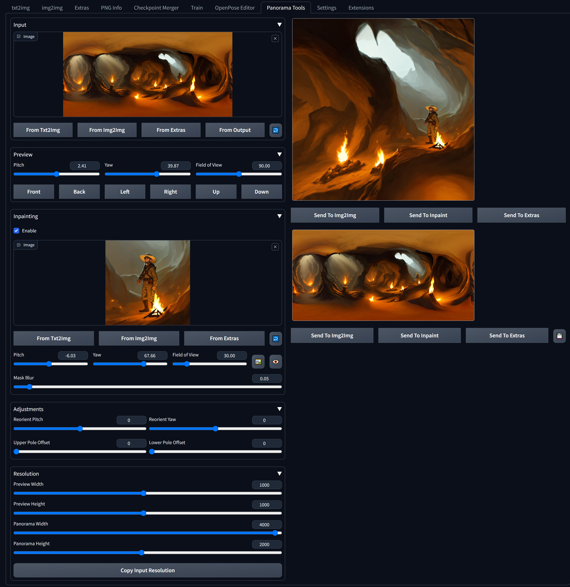
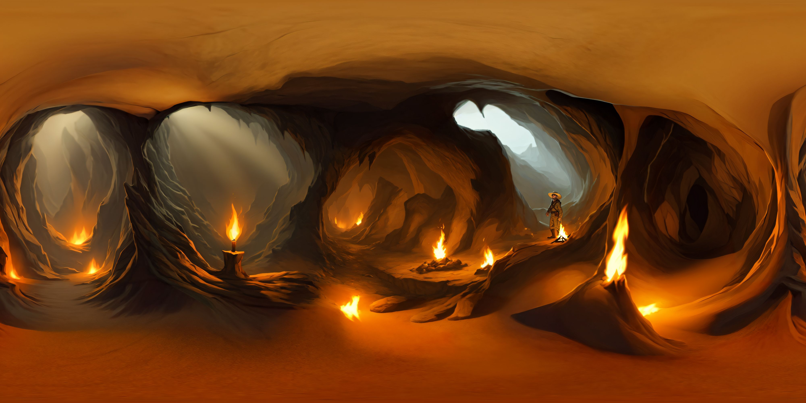
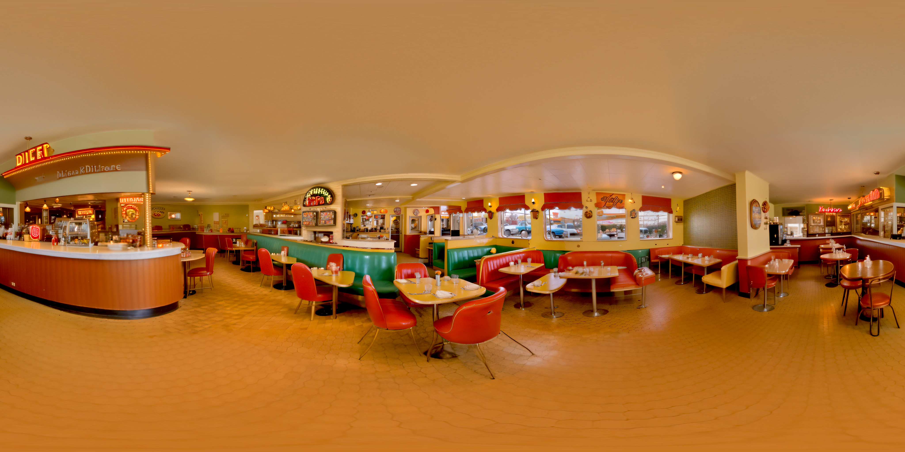
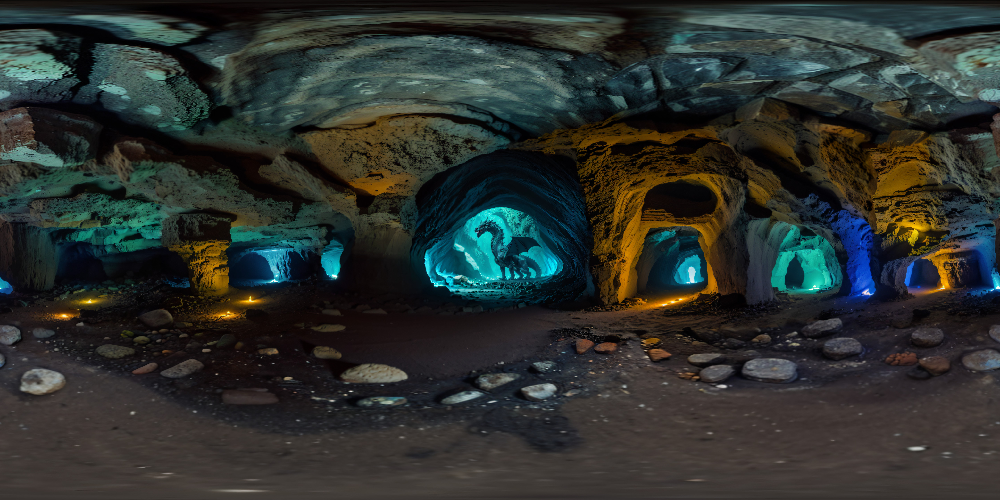
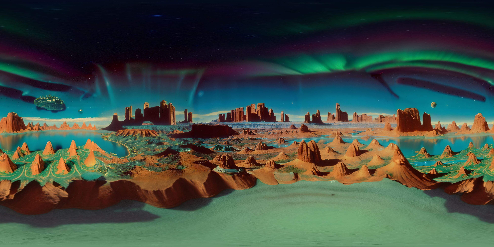

# Panorama Tools For Stable Diffusion Web UI

An extension for AUTOMATIC1111's [Stable Diffusion Web UI](https://github.com/AUTOMATIC1111/stable-diffusion-webui) which provides a number of tools for editing equirectangular panoramas.

## Examples
Some examples made using this extension, all were outpainted starting from a normal image. 

Only inpainting models were used, no LoRAs or panorama-specific prompts.

## Controls

### Input
 * **Image** - Equirectangular panorama image to be edited.
 * **From Txt2Img / Img2Img / Extras** - Copy the selected image from the respective tab.
 * **From Output** - Copy the edited panorama back to the input.
 * ↩️ Revert to previous image.

### Preview
 * 3D Preview camera parameters
 * **Pitch / Yaw** - Camera angles in degrees, can be adjusted with sliders or by dragging preview.
 * **Field of View** - Camera field of view in degrees, can be adjusted by sliders or by scroll wheel.
 * **Front / Back / Left / Right / Up / Down** - Sets camera to predefined view angles.

### Inpainting
 * Projects an image onto the panorama based on the camera settings given.
 * **Enable** - Display the inpainting image on the output preview.
 * **Image** - Image to be inpainted into the panorama.
 * **From Txt2Img / Img2Img / Extras** - Copy the selected image from the respective tab.
 * ↩️ Revert to previous image.
 * **Pitch / Yaw** - Camera angles of the inpaint image.
 * **Field of View** - Camera field of the inpaint image.
 * 🖼️ - Copy last saved camera settings from 3D preview. (saves upon clicking Send To X)
 * 👁️ - Copy current camera settings from 3D preview.
 * **Mask Blur** - Blur the edges of the inpaint blending mask.

### Adjustments
 * **Reorient Pitch / Yaw** - Adjust the default pitch / yaw of the panorama.
 * **Upper/Lower Pole Offset** - Shift the location of the upper/lower poles, for fixing up images with missing poles.

### Resolution
 * **Preview Width / Height** - Render resolution of the 3D preview and images sent to other tabs.
 * **Panorama Width / Height** - Render resolution of the 2D preview and images sent to other tabs.
 * **From Panorama Image** - Calculate panorama & preview resolutions from panorama input image.
 * **From Inpaint Image** - Calculate panorama & preview resolutions from panorama inpaint image.

## Outputs

### 3D Preview
* **Navigation** - Click & drag to look around, mouse wheel to zoom.
* **Send To Img2Img / Inpaint / Extras** - Send the current 3D preview to the respective tab & save the camera settings.

### 2D Preview
* **Send To Img2Img / Inpaint / Extras** - Send the current 2D preview to the respective tab.
* 💾 - Download the current panorama image.

## Workflows

Some roughly outlined workflows using this extension to generate / fix up panoramas.

Using an inpainting model is recommended.

### Outpainting

1. Enable inpainting in Panorama Tools tab.
2. Import a starting image using the "From *" buttons or by dragging in a starting image.
    * For generated images, send the image to inpainting to copy the prompt/settings.
3. Click Resolution -> From Inpaint Image to set the resolution of the preview & panorama.
4. Adjust field of view & pitch in the inpainting controls until the perspective looks right in the 3d preview.
5. Click "From Output" under the panorama input to apply the inpainting image.
6. Angle the 3D preview to show roughly 1/2 - 1/3 of the previous image.
    * Typically increments of 45 / 60 degrees on the yaw, depending on image contents.
    * May have to zoom out for the poles.
7. Click "Send to Inpainting" under the 3D preview.
8. Mask out the unfilled areas.
9. The following settings are recommended:
    * Masked content - Latent nothing
    * Denoising strength - 1.0
    * Inpaint area - Whole picture
10. Generate the images.
    * May have to adjust the prompt depending on desired image content.
    * i.e. "hallway" tends to always generate images looking straight down a hallway.
11. Select the desired image in the gallery.
12. Go back to the Panorama Tools tab.
13. Under Inpainting, click "From Img2Img".
14. Click the 🖼️ button to copy the camera settings used for the image.
15. Repeat from 5. until the whole panorama is filled.

### Fixing Poles

1. Enable inpainting in Panorama Tools tab.
2. Under Input, import the panorama to edit using the "From *" buttons or by dragging in an image.
    * For generated panoramas, send the image to inpainting to copy the prompt/settings.
3. Under resolution, click "Copy Input Resolution" to set the optimal panorama/preview resolutions.
4. If the poles are missing/cropped out:
    1. Adjust Upper/Lower Pole Offset until the perspective looks right in the 3D preview.
        * Typicially when the horizon/vanishing point is roughly centered vertically with the preview pitch set to 0.
    2. Click "From Output" under the panorama input to apply the adjustments.
    3. Zero out all settings under Adjustments.
5. Angle / zoom the preview to see the pole to inpaint.
    * Up / Down buttons in the Preview settings
6. Click "Send to Inpainting" under the 3D preview.
7. Mask out the pole area.
8. The following settings are recommended:
    * Masked content - Fill / Latent noise / Latent nothing 
    * Denoising strength - 0.7-0.9 / 0.7-0.9 / 1.0
    * Inpaint area - Whole picture / Only masked
9. Update the prompt based on what's visible around the pole and remove any panorama/360 prompts.
10. Generate the images.
11. Select the desired image in the gallery.
12. Go back to the Panorama Tools tab.
12. Under Inpainting, click "From Img2Img".
14. Click the 🖼️ button to copy the camera settings used for the image.
15. Click "From Output" under the panorama input to apply the inpainting image.
16. Repeat from 5. for both poles.

### Inpainting in an external program

1. Right click the preview and click "Copy Image"
    * Do not change the preview settings after doing this.
2. Paste into your image editing program and edit as needed.
3. Copy the image from your image editing program.
4. Hide the panorama Input
5. Paste the image into the inpainting input.
6. Click the 👁️ button to copy the camera angles from the preview.
7. Enable inpainting. 
8. Adjust the Mask Blur as needed to blend in the edited image.
10. Click "From Output" under the panorama input to apply the inpainting image.